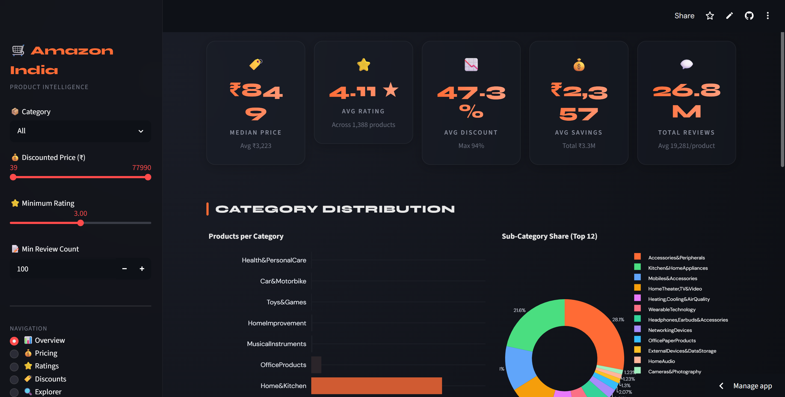
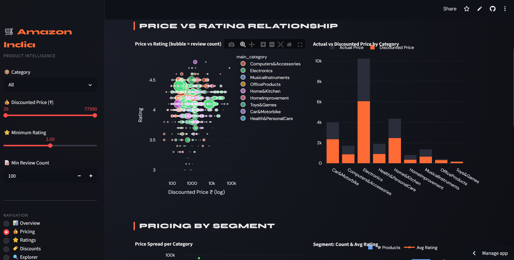
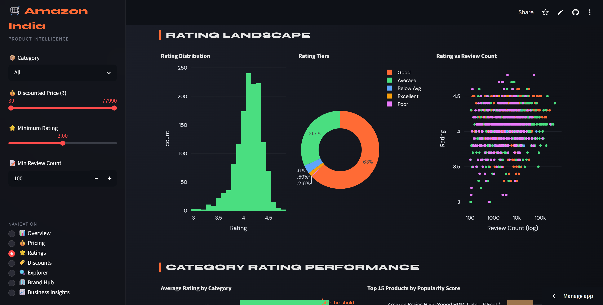
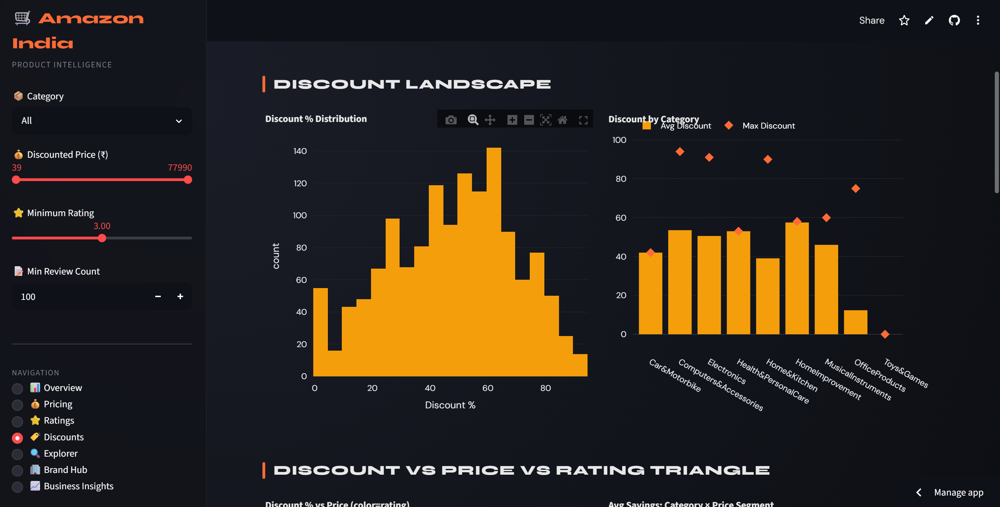

# 🛒 Amazon India Product Analytics Dashboard

An interactive data analytics dashboard built using **Python, Streamlit, Pandas, and Plotly** to analyze Amazon India product data and generate actionable business insights.

## 🚀 Live Demo

**Dashboard:** https://amazon-dashboard-39r39hqbqoedlrsxfbpaww.streamlit.app/

---

## 📌 Project Overview

This project analyzes **1,465 Amazon India products** to uncover pricing trends, customer rating patterns, discount strategies, and category-level business insights.

The dashboard helps identify:

* High-performing product categories
* Hidden gem products
* Pricing vs Rating relationships
* Fake discount patterns
* Best value-for-money products
* Category-wise performance metrics

---

## 📊 Dashboard Preview

### Overview Dashboard



### Pricing Analysis



### Ratings & Reviews



### Product Discount



---

## ✨ Key Features

### 📊 Overview Analysis

* Product category distribution
* Price segmentation analysis
* Product count by category

### 💰 Pricing Intelligence

* Price vs Rating visualization
* Premium vs Budget product comparison
* Price distribution analysis

### ⭐ Ratings & Reviews

* Customer rating analysis
* Popularity score calculation
* Hidden gem identification

### 🏷️ Discount Intelligence

* Discount percentage analysis
* Fake MRP detection
* Top discounted products

### 🔍 Product Explorer

* Search products by keyword
* Dynamic filtering
* Category-based exploration

### 📈 Business Insights

* Correlation analysis
* Value-for-money scoring
* Strategic recommendations

---

## 🛠️ Tech Stack

* Python
* Streamlit
* Pandas
* NumPy
* Plotly
* Matplotlib

---

## 📂 Dataset

Amazon India Product Dataset containing:

* Product Name
* Category
* Actual Price
* Discounted Price
* Ratings
* Rating Count
* Discount Percentage

Total Records: **1,465 Products**

---

## 🎯 Business Problems Solved

### 1. Fake Discount Detection

Identifies products with unusually high discount percentages.

### 2. Hidden Gem Discovery

Finds highly-rated products with strong discounts but lower visibility.

### 3. Value-for-Money Scoring

Ranks products based on quality relative to price.

### 4. Price-Quality Analysis

Determines whether expensive products actually receive better ratings.

### 5. Category Benchmarking

Compares categories across pricing, ratings, and discount performance.

---

## ⚙️ Installation

```bash
git clone https://github.com/Raushanritik30891/AMAZON-DASHBOARD.git

cd AMAZON-DASHBOARD

pip install -r requirements.txt

streamlit run app.py
```

---

## 👨‍💻 Author

Ritik Raushan

Aspiring Data Analyst | Machine Learning Enthusiast | AI Developer
